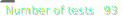
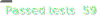
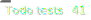
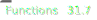
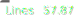
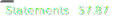

<!--
© 2024 INRAE
SPDX-FileContributor: Marcellino Palerme <marcellino.palerme@inrae.fr>

SPDX-License-Identifier: MIT
-->

# EP2M2 : Metabolomic Target Analyzes Manager.

## Version
__0.3.1__

## Reuse compliance
<!--REUSE--></br>
[](https://github.com/p2m2/EP2M2/actions/runs/12177324911)<!--REUSE-END-->  

## Tests
<!--GAMFC--></br>
[    ](https://github.com/p2m2/EP2M2/actions/runs/11927786993) </br>[   ](https://github.com/p2m2/EP2M2/actions/runs/11927786993)<!--GAMFC-END-->

## Features
- Extraction of formats files of the metabolomics data acquisition devices of the P2M2 platform
  - gcms
  - openlabcds
  - masslynx-txt
  - masslynx-xml
  - xcalibur
- Analyzes concatenation
- Custom post-process
- Data base of:
  - External compound
  - Devices
  - Associated calibration curves

## Installation

### Requirements  
- adminitrator rights
- docker
- docker-compose
- docker with sudo rights

### Linux

1. Clone the repository
2. Define user and password for the database and the database name

```bash
cd EP2M2
echo "PGUSER=<user_name>" > ./secrets/pg.env
echo "PGPASSWORD=<password>" >> ./secrets/pg.env
echo "PGDATABASE=<database_name>" >> ./secrets/pg.env
echo "POSTGRES_USER=\$PGUSER" >> ./secrets/pg.env
echo "POSTGRES_PASSWORD=\$PGPASSWORD" >> ./secrets/pg.env
echo "POSTGRES_DB=\$PGDATABASE" >> ./secrets/pg.env
```

3. Launch the docker-compose

```bash
docker compose -f compose.yaml up -d
```

## Contibution
[let's go](./doc/contribution.md)
## Report issue
- Directly on github
- Send e-mail at [team](mailto:p2m2-it@inrae.fr)
