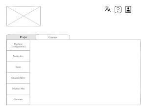
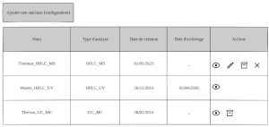
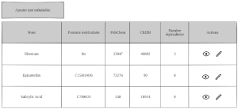
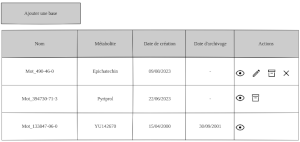
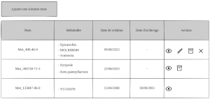
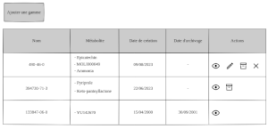

<!--
SPDX-FileCopyrightText: 2024 Marcellino Palerme <marcellino.palerme@inrae.fr>

SPDX-License-Identifier: CC-BY-NC-4.0
-->

# Architecture du site web

## Layout par défaut

Ce layout sera présent sur toute les pages du site.

### Description

Il se décompose en deux parties:
 - En haut:
    - À gauche: l'icône du site
    - À droite:
        - Le bouton de changement de langue
        - Le bouton d'aide
        - Le bouton de déconnexion
 - En bas: le corps du site.

### Fonctionnalités

 1. L'icône du site:
    - Dépend de la langue du site
    - Cliquable → renvoie à la racine du site
 2. Le bouton de changement de langue
    - En cliquant dessus, il affiche les langues disponibles
    - Cliquer sur un langue change la langue du site
 3. Le bouton d'aide
    - En survolant le bouton, affichage de l'aide contextuelle des éléments visibles sur la page
    - En cliquant dessus, il affiche les liens vers un tutorial et l'aide en ligne.
 4. Le bouton logout
    - En cliquant dessus, on se déloggue du site.

## Layout de navigation
### Description
Ce layout s'intégre dans le layout par défaut.
Il se compose de deux onglets, projet et gamme.
### Fonctionnalités
1. Le layout n'est accessible qu'une fois l'utilisateur identifié.
2. Les onglets sont cliquables
3. L'onglet projet donne accès au tableau de projet de l'équipe de l'utilisateur.
4. L'onglet gamme donne accès à l'espace de gestion des gammes.

## Page projet
### Description

## Page gamme
### Description

La page gamme permet de remplir l'ensemble des éléments permettants definir un gamme. Cette page se compose de 6 onglet:
1. Machine (configuration) : Gére les différentes configuration de machine d'analyse métabolomique
2. Molécules: Gére l'ensemble des molécules utilisées lors des analyses
3. Bases: Répertorie les poudres utilisées.
4. Solution mère: Répertorie les solutions mères constituées à partir d'une poudre
5. Solution mix: Répertorie les solutions formulées à partir de plusieurs solutions mères
6. Gammes: Gére les gammes utilisées dans les projets.
### Machine (configuration)
#### Description

Gére les différentes configuration de machine d'analyse métabolomique
#### Fonctionnalités
### Molécules
#### Description

Gére l'ensemble des molécules utilisées lors des analyses
#### Fonctionnalités
### Bases
#### Description

Répertorie les poudres utilisées.
#### Fonctionnalités
### Solution mère
#### Description

Répertorie les solutions formulées à partir de plusieurs solutions mères
#### Fonctionnalités
### Solution mix
#### Description

Répertorie les solutions formulées à partir de plusieurs solutions mères
#### Fonctionnalités
### Gamme
#### Description

Gére les gammes utilisées dans les projets.
#### Fonctionnalités
1. Bouton d'ajout d'une gamme (ouvre une overlay)
   1. Remplir le nom de la gamme
   2. Choisir la configuration de la machine
   3. Choix de la ou des solutions mixes utilisées. Pour le choix un champ recherche est mis à disposition. Une liste de solutions mixtes s'affiche. Il est possible de sélectionner une ou plusieurs solutions.
   4. Téléverser les fichiers machine de chaque solution fille (dilution de solution miste).
   5. Indiquer la dilution de chaque solution fille.
   6. Possibilité d'indiquer l'utilisation d'un témoin interne. Un champ de recherche est mis à disposition pour trouver le nom du témoin. 
   
2. Un tableau de liste des gammes composé:  
   1. Un nom
   2. Une liste des métabolites
   3. Une Date de création 
   4. Une Date d'archive
   5. Les actions (consultation \ modification \ archivage \ suppression) 